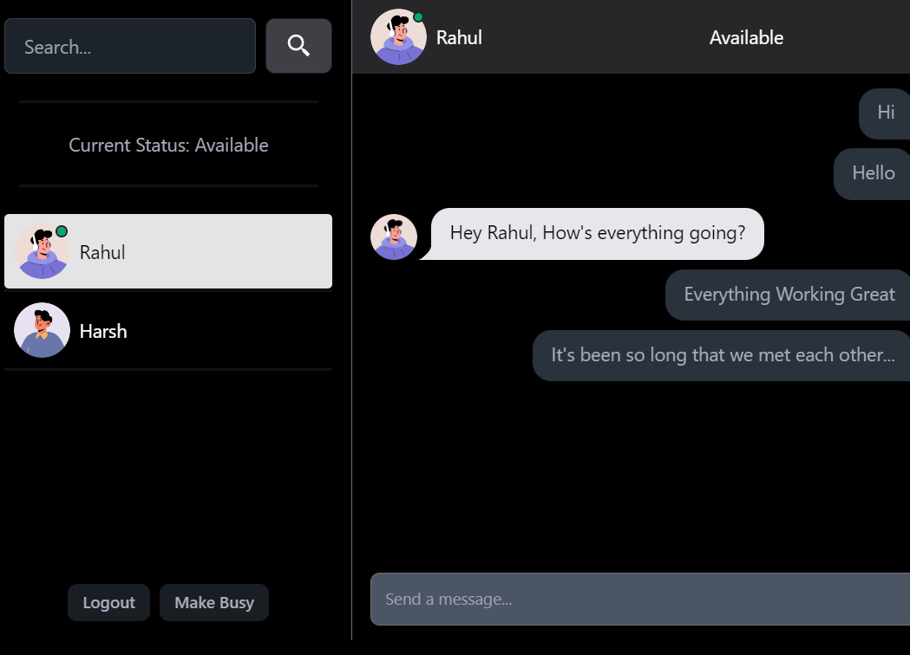

# ChatApp HQ




Welcome to ChatApp HQ, a messaging application project with both backend and frontend components. This README will guide you through the setup process, provide information on running the backend and frontend, and detail various API endpoints along with their descriptions, expected inputs, and outputs.

## Setup

### Backend

1. Clone the repository:
   git clone https://github.com/rahulvijay5/chatApp_hq.git

2. Navigate to the backend directory:
   cd chatApp_hq/backend

3. Install dependencies:
   npm install
4. Update .env.sample -
   Change it to .env and update variables with your values.

### Frontend

1. Navigate to the frontend directory:
   cd chatApp_hq/frontend

2. Install dependencies:
   npm install

## Running the Application

### Backend

- For development (localhost):
  npm run dev

- For production:
  npm start

### Frontend

- Run the frontend:
  npm start

## API Endpoints
### User Routes

| REST Method | URL                              | Inputs                                                  | Outputs                                       |
| ----------- | -------------------------------- | ------------------------------------------------------- | --------------------------------------------- |
| POST        | /api/v1/user/register            | {"fullName": "", "username": "", "password": "", "confirmPassword": "", "gender": "", "status": ""} | Status Code, Message, and User Object         |
| POST        | /api/v1/user/login               | {"username": "", "password": ""}                       | Status Code and User Object                   |
| GET         | /api/v1/user/logout              | -                                                       | Status Code and message                      |
| GET         | /api/v1/user/                    | -                                                       | Status Code and List of Other Users          |
| POST        | /api/v1/user/updatestatus        | {"userId": "", "status": ""}                           | Status Code and complete User Object         |
| GET         | /api/v1/user/status              | {"userId": ""}                                          | Status Code and User Status Object           |
| GET         | /api/v1/user/status/:userId      | -                                                       | Status Code and User Status Object           |

### Message Routes

| REST Method | URL                            | Inputs                                              | Outputs                                   |
| ----------- | ------------------------------ | --------------------------------------------------- | ----------------------------------------- |
| POST        | /api/v1/message/send/:id       | {"senderId": "", "message": ""}                    | Status Code and New Message Object        |
| GET         | /api/v1/message/:id            | {"senderId": ""}                                   | Status Code and List of Messages          |

### AI Routes

| REST Method | URL                        | Inputs                | Outputs                            |
| ----------- | -------------------------- | --------------------- | ---------------------------------- |
| POST        | /api/v1/user/ai/chat       | {"prompt": ""}        | Status Code and AI Response Object |

## Middlewares

The `isAuthenticated` middleware function is used to authenticate user requests. It verifies the JWT token present in the request cookie and sets the `req.id` property if the token is valid.

## Example Usage of Middleware

```javascript
import jwt from "jsonwebtoken";

const isAuthenticated = async (req, res, next) => {
  try {
    const token = req.cookies.token;
    if (!token) {
      return res.status(401).json({ message: "User not authenticated." });
    }
    const decode = await jwt.verify(token, process.env.JWT_SECRET_KEY);
    if (!decode) {
      return res.status(401).json({ message: "Invalid token" });
    }
    req.id = decode.userId;
    next();
  } catch (error) {
    console.log(error);
  }
};

export default isAuthenticated;

const req = {
  id: "",
};
req.id = "sdlbgnjdfn";
```

## Video Demo

You can watch the demo of the application on Drive:
[Demo Video](https://drive.google.com/file/d/12WusiAIt_w5SB6eLGtl32zx7K1geB5SW/view?usp=sharing)

## Project Documentation

You can find detailed project documentation in the [Project Documentation PDF](./ChatAppHQ.pdf).

## Source Code

The source code for this project can be found on GitHub:
[Project Repository](https://github.com/rahulvijay5/chatApp_hq)

## Google Drive Link

You can access additional resources and files related to the project on Google Drive:
[Google Drive Link](https://drive.google.com/your_drive_link)
